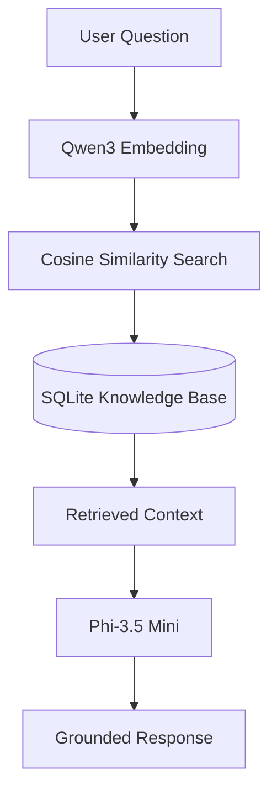

# LTechStore Local RAG AI Assistant

A fully offline Retrieval-Augmented Generation (RAG) assistant built with **Microsoft Foundry Local**, **Phi-3.5 Mini**, **Qwen3 Embedding**, and **SQLite**.

The assistant retrieves relevant information from a local knowledge base using semantic search and generates context-aware responses without relying on cloud services, external APIs, or internet access.

---

## Overview

LTechStore Local RAG AI Assistant is a local AI application that demonstrates a complete Retrieval-Augmented Generation (RAG) workflow using Microsoft's Foundry Local SDK.

Instead of sending user queries to online AI services, the application retrieves relevant document chunks from a local SQLite database using semantic similarity and provides them as context to a locally hosted language model.

The entire pipeline, including document ingestion, embedding generation, vector retrieval, and response generation, runs locally.

---

## Features

* Fully offline AI assistant
* Microsoft Foundry Local integration
* Phi-3.5 Mini language model
* Qwen3 Embedding model
* Retrieval-Augmented Generation (RAG)
* Automatic document ingestion
* Semantic vector search
* Cosine similarity retrieval
* SQLite knowledge base
* Source-grounded responses
* Source citation
* Command Line Interface (CLI)
* Privacy-first architecture
* No cloud dependency
* No API costs

---

## Architecture



---

## How It Works

1. Documents are loaded from the `documents` directory.
2. Each document is split into searchable text chunks.
3. Embeddings are generated using the Qwen3 Embedding model.
4. Chunks and embeddings are stored in a local SQLite database.
5. User questions are converted into embeddings.
6. Cosine similarity is used to retrieve the most relevant document chunks.
7. Retrieved context is combined with the user query.
8. Phi-3.5 Mini generates a grounded response.
9. The assistant returns the generated answer together with its source document.

If no relevant information is found, the assistant responds with:

```text
I don't know based on the available documents.
```

---

## Project Structure

```text
LTechStore-Local-RAG-Assistant/
│
├── documents/
│   ├── company_info.txt
│   ├── faq.txt
│   ├── inventory.txt
│   ├── manual.txt
│   ├── products.txt
│   └── sales.txt
│
├── app.py
├── ingest.py
├── ltechstore_rag.db
├── requirements.txt
└── README.md
```

| File                | Description                                               |
| ------------------- | --------------------------------------------------------- |
| `app.py`            | Main application and RAG inference pipeline               |
| `ingest.py`         | Builds the local knowledge base by processing documents   |
| `documents/`        | Local knowledge source used by the assistant              |
| `ltechstore_rag.db` | SQLite database containing document chunks and embeddings |
| `requirements.txt`  | Python dependencies                                       |

---

## Installation

### Prerequisites

Before running the project, make sure the following software is installed:

* Python 3.10 or later
* Microsoft Foundry Local
* Git (optional)

Download the required local models through Microsoft Foundry Local:

* Phi-3.5 Mini
* Qwen3 Embedding

---

### Clone the Repository

```bash
git clone https://github.com/larinntok/LTechStore-local-rag-assistant.git

cd LTechStore-local-rag-assistant
```

---

### Create a Virtual Environment

Windows

```bash
python -m venv .venv

.venv\Scripts\activate
```

Linux / macOS

```bash
python3 -m venv .venv

source .venv/bin/activate
```

---

### Install Dependencies

```bash
pip install -r requirements.txt
```

---

## Building the Knowledge Base

Before starting the assistant, create the local knowledge base by indexing the documents.

```bash
py ingest.py
```

The ingestion process:

* Reads all documents in the `documents` directory
* Splits documents into chunks
* Generates embeddings
* Stores chunks and embeddings in SQLite
* Creates the searchable knowledge base

Whenever documents are updated or new files are added, run the ingestion script again to rebuild the database.

---

## Running the Assistant

Start the assistant with:

```bash
py app.py
```

After initialization, the application loads:

* Microsoft Foundry Local
* Phi-3.5 Mini
* Qwen3 Embedding
* SQLite knowledge base

The assistant is then ready to answer questions.

---

## Knowledge Base

The assistant retrieves information exclusively from local documents stored in the `documents` directory.

Current knowledge sources:

| Document           | Content                    |
| ------------------ | -------------------------- |
| `company_info.txt` | Company information        |
| `faq.txt`          | Frequently asked questions |
| `inventory.txt`    | Inventory summary          |
| `manual.txt`       | Product usage manual       |
| `products.txt`     | Product catalog            |
| `sales.txt`        | Sales records              |

No external websites, APIs, or internet search are used during inference.

---

## Example Questions

```text
Who is the company owner?

What products do you sell?

Is the Laptop in stock?

What are your working hours?

What is your warranty policy?

How can I contact customer support?

Which product has the highest sales?

What is the unit price of the Tablet?
```

---


## Example Output

### Question


```text
What is your warranty and return policy?
```

### Response

```text
All technology products include a two-year official warranty.
Returns are accepted within 14 days of purchase with the original receipt.
```

**Source**

```text
faq.txt
```

---

### Question

```text
Who is the president of France?
```

### Response

```text
I don't know based on the available documents.
```

This behavior ensures that responses remain grounded in the indexed knowledge base instead of relying on the language model's general knowledge.

---

## Technologies

| Category             | Technology              |
| -------------------- | ----------------------- |
| Programming Language | Python                  |
| AI Runtime           | Microsoft Foundry Local |
| Language Model       | Phi-3.5 Mini            |
| Embedding Model      | Qwen3 Embedding         |
| Database             | SQLite                  |
| Vector Search        | Cosine Similarity       |
| Numerical Computing  | NumPy                   |

---

## Future Improvements

The current implementation demonstrates a complete local RAG workflow. Possible future enhancements include:

* PDF document ingestion
* CSV document ingestion
* FAISS vector indexing
* Hybrid keyword and semantic search
* Conversation history
* Web interface
* Docker support
* REST API
* Unit testing
* GitHub Actions CI/CD

---

## Author

**Larin Tok**

Mathematics and Computer Science Student

Microsoft Foundry Local Summer School Project

**Areas of Interest**

* Artificial Intelligence
* Retrieval-Augmented Generation (RAG)
* Data Engineering
* Machine Learning
* Local AI Systems

---

## License

This project is licensed under the MIT License.

