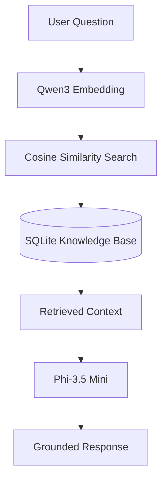
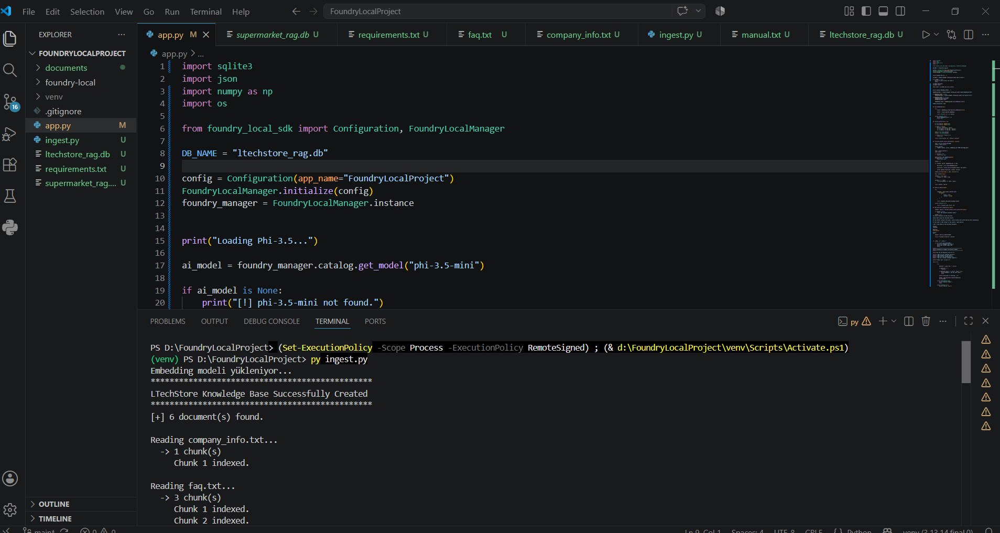
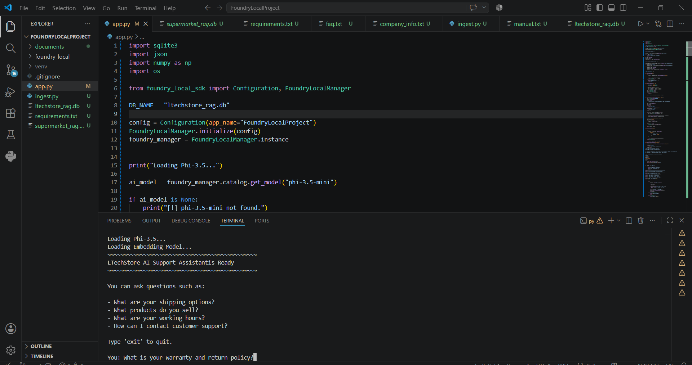
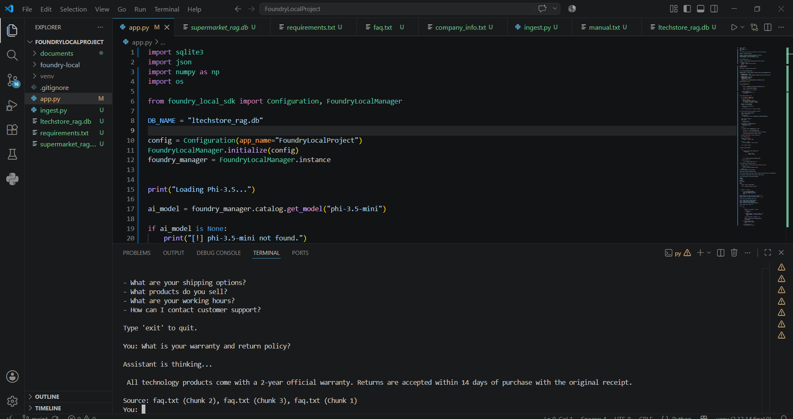
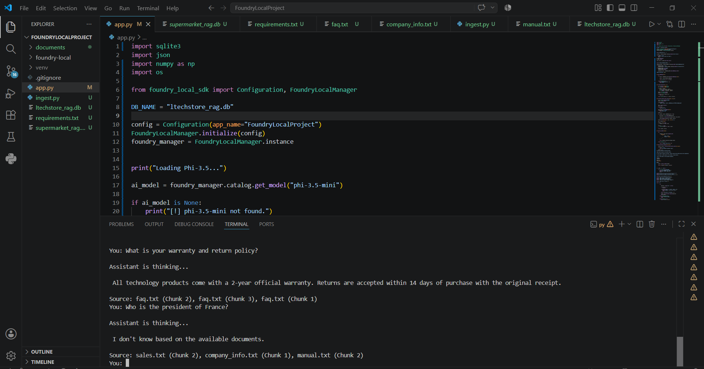

# LTechStore Local RAG AI Assistant

An offline Retrieval-Augmented Generation (RAG) assistant that answers questions using information retrieved from local documents. Built with Microsoft Foundry Local, Phi-3.5 Mini, Qwen3 Embedding, and SQLite.

## Overview

LTechStore Local RAG AI Assistant is a simple offline application built for a fictional technology store. It demonstrates how to build a Retrieval-Augmented Generation (RAG) pipeline using Microsoft Foundry Local. 

The assistant searches a local knowledge base containing company information, product details, inventory, sales records, and FAQs. It retrieves the most relevant document chunks using semantic search and generates answers based only on the retrieved context, without relying on external APIs or cloud services.

## Features

- Runs completely offline
- Retrieval-Augmented Generation (RAG)
- Microsoft Foundry Local integration
- Phi-3.5 Mini language model
- Qwen3 Embedding model
- Semantic vector search
- SQLite knowledge base
- Automatic document ingestion
- Source-grounded responses with citations
- No cloud services or external APIs
- No API costs
- Command Line Interface (CLI)

---

## Architecture



## How It Works

1. Documents are loaded from the `documents` directory.
2. Each document is split into searchable text chunks.
3. Embeddings are generated using the Qwen3 Embedding model.
4. Chunks and embeddings are stored in a local SQLite database.
5. User questions are converted into embeddings.
6. Cosine similarity is used to retrieve the most relevant document chunks.
7. Retrieved context is combined with the user query.
8. Phi-3.5 Mini generates an answer based only on the retrieved context.
9. The assistant returns the generated answer together with its source document.

If no relevant information is found, the assistant responds with:

```text
I don't know based on the available documents.
```

---

## Project Structure

```text
LTechStore-Local-RAG-Assistant/
│
├── assets/
│   ├── demo1.png
│   ├── demo2.png
│   ├── demo3.png
│   └── demo4.png
│
├── documents/
│   ├── company_info.txt
│   ├── faq.txt
│   ├── inventory.txt
│   ├── manual.txt
│   ├── products.txt
│   └── sales.txt
│
├── app.py
├── ingest.py
├── ltechstore_rag.db
├── requirements.txt
└── README.md
```

| File                | Description                                               |
| ------------------- | --------------------------------------------------------- |
| `app.py`            | Main application and RAG inference pipeline               |
| `ingest.py`         | Builds the local knowledge base by processing documents   |
| `documents/`        | Local knowledge source used by the assistant              |
| `ltechstore_rag.db` | SQLite database containing document chunks and embeddings |
| `requirements.txt`  | Python dependencies                                       |

---

## Installation

### Prerequisites

Before running the project, make sure the following software is installed:

* Python 3.10 or later
* Microsoft Foundry Local
* Git (optional)

Download the required local models through Microsoft Foundry Local:

* Phi-3.5 Mini
* Qwen3 Embedding

---

### Clone the Repository

```bash
git clone https://github.com/larinntok/LTechStore-local-rag-assistant.git

cd LTechStore-local-rag-assistant
```

---

### Create a Virtual Environment

Windows

```bash
python -m venv .venv

.venv\Scripts\activate
```

Linux / macOS

```bash
python3 -m venv .venv

source .venv/bin/activate
```

---

### Install Dependencies

```bash
py -m pip install -r requirements.txt
```

---

## Building the Knowledge Base

Before starting the assistant, create the local knowledge base by indexing the documents.

```bash
py ingest.py
```

The ingestion process:

* Reads all documents in the `documents` directory
* Splits documents into chunks
* Generates embeddings
* Stores chunks and embeddings in SQLite
* Creates the searchable knowledge base

Whenever documents are updated or new files are added, run the ingestion script again to rebuild the database.

---

## Running the Assistant

Start the assistant with:

```bash
py app.py
```

After initialization, the application loads:

* Microsoft Foundry Local
* Phi-3.5 Mini
* Qwen3 Embedding
* SQLite knowledge base

Once the models are loaded, you can start asking questions from the command line.

---

## Knowledge Base

The assistant only uses the documents stored in the documents directory. It doesn't access the internet or external APIs.

Current knowledge sources:

| Document           | Content                    |
| ------------------ | -------------------------- |
| `company_info.txt` | Company information        |
| `faq.txt`          | Frequently asked questions |
| `inventory.txt`    | Inventory summary          |
| `manual.txt`       | Product usage manual       |
| `products.txt`     | Product catalog            |
| `sales.txt`        | Sales records              |

---

## Example Questions

```text
Who is the company owner?

What products do you sell?

Is the Laptop in stock?

What are your working hours?

What is your warranty policy?

How can I contact customer support?

Which product has the highest sales?

What is the unit price of the Tablet?
```

---


## Example Output

### Question

```text
What is your warranty and return policy?
```

### Response

```text
All technology products include a two-year official warranty.
Returns are accepted within 14 days of purchase with the original receipt.
```

**Source**

```text
faq.txt
```

---
### Question

```text
Who is the president of France?
```

### Response

```text
I don't know based on the available documents.
```

This behavior ensures that responses remain grounded in the indexed knowledge base instead of relying on the language model's general knowledge.

---

## Technologies

| Category             | Technology              |
| -------------------- | ----------------------- |
| Programming Language | Python                  |
| AI Runtime           | Microsoft Foundry Local |
| Language Model       | Phi-3.5 Mini            |
| Embedding Model      | Qwen3 Embedding         |
| Database             | SQLite                  |
| Vector Search        | Cosine Similarity       |
| Numerical Computing  | NumPy                   |

---

## Future Improvements

This project can be extended with additional features such as:

- PDF document support
- CSV document support
- FAISS vector indexing
- Conversation memory
- Streamlit web interface

---

## Author

**Larin Tok**

Mathematics and Computer Science Student

Microsoft Foundry Local Summer School Project
